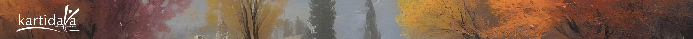

.. itdept_docs documentation master file, created by
   sphinx-quickstart on Tue Apr  8 16:20:09 2025.
   You can adapt this file completely to your liking, but it should at least
   contain the root `toctree` directive.

Dokumentasi Departemen IT
=========================

**Selamat Datang**

Ini adalah dokumentasi referensi untuk tugas-tugas yang berhubungan dengan *IT support* di Kartidaya.

.. Add your content using ``reStructuredText`` syntax. See the
.. `reStructuredText <https://www.sphinx-doc.org/en/master/usage/restructuredtext/index.html>`_
.. documentation for details.

.. toctree::
   :caption: Ortografi
   :maxdepth: 2

   ortografi/ortografi
   ortografi/mencetak_buklet
   ortografi/mengekspor_kamus
   ortografi/menggabung_kamus

.. toctree::
   :caption: Hardware Support
   :maxdepth: 2

   hardware_support/hardware_support
   hardware_support/setup
   hardware_support/hardware_maintenance

.. toctree::
   :caption: Software Support
   :maxdepth: 2

   software_support/software_support
   software_support/audacity
   software_support/office
   software_support/paratext
   software_support/rev79

.. toctree::
   :caption: Web Development
   :maxdepth: 2

   web/web_development
   web/arsip_buletin
